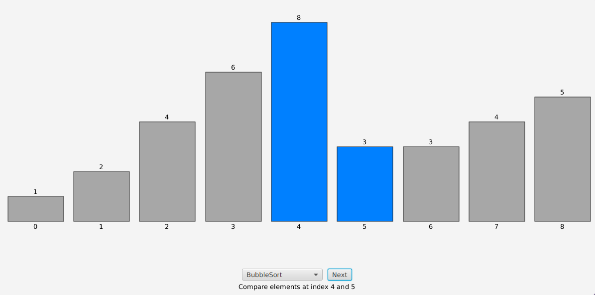

# Sorting Visualizer

A simple JavaFX application to visualize sorting algorithms like **QuickSort** and **BubbleSort** step-by-step.

## Features

- Step through sorting algorithms one action at a time
- Visualize comparisons, swaps, highlights, and pivots
- Choose between multiple sorting algorithms

## Screenshot



## Requirements

- Java 23
- JavaFX 

## Run

Compile and run the `App` class from your IDE or with:

```bash
nix develop
./gradlew clean build run
```
